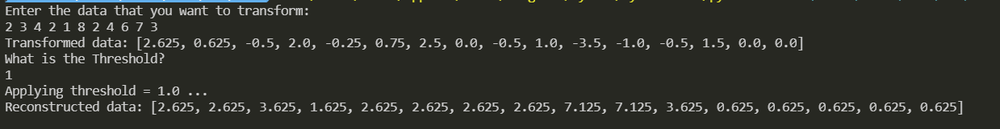
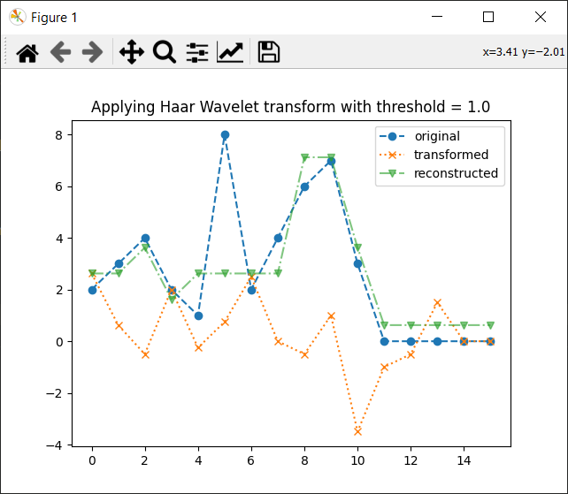
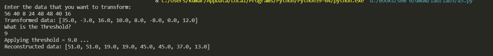
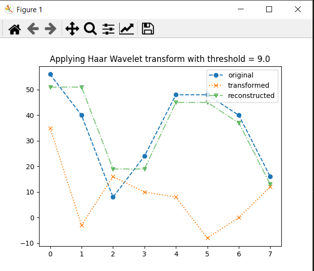
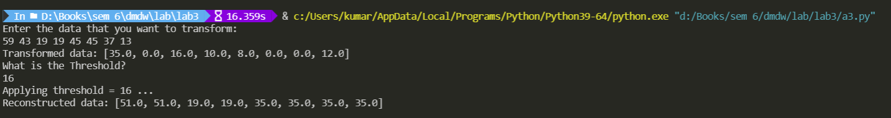
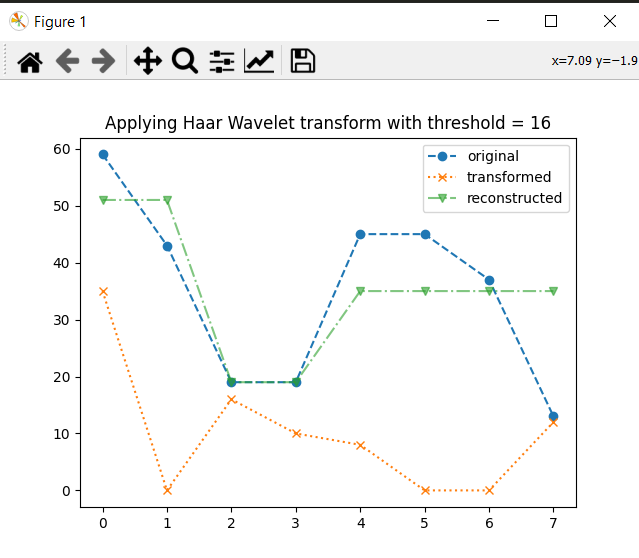

<div>
    <center>
        <h1>
            Data Warehouse <br> and <br> Data Mining Lab
        </h1>
        <h3>
            CSE 326
        </h3>
    </center>
</div>


<div>
    <center>
    	<h3>
            Lab - 3
        </h3>
        Performing data reduction using Haar wavelet transformation.
    </center>
</div>


<pre>
    Gyanendra Kr. Shukla
    CSE 1
    191112040
</pre>


## Assignment Problem

Write a program to perform data reduction using wavelet (Haar) transformation on the given input by user. Also, extend the same program to perform inverse wavelet transform.

 1. First take input from user

 2. Apply wavelet transform

 3. Print transformed data

 4. Ask user to decide threshold

 5. Apply inverse wavelet transform

 6. Plot original data, transformed data and reconstructed data

    Make this program generalised to take input of any size.


## Approach Used

Haar wavelet transform is used on data whose size is power of two. So, as the first step, I made sure the data was padded with 0 until its size was power of two. For the transform function, I'm maintaining two arrays, one for average and another for transformed data. After transforming half of the array, i move it to final array and process the other half of the data next. 

For application of threshold, I simply check if the element is above it or not, if not then I replace the value with 0. 


## Code

```python
import math
from typing import List
import matplotlib.pyplot as plt


def make_size_power_of_two(data: List[float]) -> List[float]:
    """
    Haar wavelet transform works only on power of two data
    So, Append zeros to the data until the data is a power of two
    """
    s = len(data)
    req_s = 2**math.ceil(math.log2(s))

    new_data = data.copy()
    for _ in range(s, req_s):
        new_data.append(0)

    return new_data


def transform(data : List[float]) -> List[float]:
    """
    Apply Haar-wavelet transform on the data

    """

    averages = data
    transformed_data = []
    new_averages = []
    while len(averages) > 1:
        details_coeff = []
        for i in range(0, len(averages), 2):
            new_averages.append((averages[i] + averages[i+1]) / 2)
            details_coeff.append((averages[i] - averages[i+1]) / 2)
        transformed_data = details_coeff + transformed_data
        averages = new_averages
        new_averages = []
    transformed_data = averages + transformed_data

    return transformed_data


def apply_threshold(data : List[float], threshold : float) -> List[float]:
    new_data = [d if d>=threshold else 0 for d in data]
    return new_data

def inverse_transform(data):
    """
    Apply inverse Haar-wavelet transform on the data
    """
    
    averages = data[:1]
    details_coeff = data[1:]

    while len(details_coeff) > 0:
        new_averages = []
        for av in averages:
            new_averages.append(av+details_coeff[0])
            new_averages.append(av-details_coeff[0])
            details_coeff = details_coeff[1:]
        averages = new_averages
    return averages


def plot(resized_data, transformed_data, inverse_transformed, threshold=None):
    """
    This function plots the original data, transformed data and
    reconstructed data.
    """
    
    fig = plt.figure()
    ax1 = fig.add_subplot(111)

    ax1.plot(resized_data, label='original', marker='o', linestyle='dashed')
    ax1.plot(transformed_data, label='transformed', marker='x', linestyle=':')
    ax1.plot(inverse_transformed, label='reconstructed', marker='v', linestyle='-.', alpha=0.6)

    if threshold:
        title = f"Applying Haar Wavelet transform with threshold = {threshold}"
    else:
        title ="Applying Haar Wavelet transform"
    
    plt.title(title)

    plt.legend(loc="upper right")
    plt.show()


def haar_wavelet_transform():
    """
    This function takes input from the user and calls the
    required functions to perform Haar wavelet transform
    """
    
    print("Enter the data that you want to transform:")
    data = [float(x) for x in input().split()]
    
    # making sure that the data is a power of two
    resized_data = make_size_power_of_two(data)

    # applying the haar wavelet transform
    transformed_data = transform(resized_data)
    print("Transformed data:", transformed_data)

    # what is the threshold?
    print("What is the Threshold?")
    threshold = float(input())

    print(f"Applying threshold = {threshold} ...")
    # applying the threshold
    threshold_applied = apply_threshold(transformed_data, threshold)

    # applying the inverse transform
    inverse_transformed = inverse_transform(threshold_applied)
    print("Reconstructed data:", inverse_transformed)

    # plotting the results
    plot(resized_data, transformed_data, inverse_transformed, threshold)
    print("")


if __name__ == "__main__":
    haar_wavelet_transform()


```

## Description of Code

1. `make_size_power_of_two` - This function makes sure that the size of the data is a power of two, if its not then it appends zeros to the data until it is a power of two.

2. `transform` - This function applies the Haar wavelet transform on the data. It maintains two arrays, one for average and another for transformed data. After transforming half of the array, i move it to final array and process the other half of the data next.

3. `apply_threshold` - This function applies the threshold on the transformed data. If the element is above the threshold then it is kept, else it is replaced with 0.

4. `inverse_transform` - This function applies the inverse Haar wavelet transform on the data. It is similar to the transform function, but it is applied on the transformed data. We keep one averages and a detailed coefficients array. We move the averages to the final array and process the details coefficients one by one, process one detail then pop it from the array.

5. `plot` - This function plots the original data, transformed data and reconstructed data.

6. `haar_wavelet_transform` - This function takes input from the user and calls the required functions to perform Haar wavelet transform.


## Screenshot

<div>
    
    <!-- <caption>
        Screenshot of the code
    </caption> -->
    
    <p>
        <center>Fig 1 </center>
    </p>
</div>
<br>

<div>
    
    <!-- <caption>
        Screenshot of the code
    </caption> -->
    
    <p>
        <center>Fig 2 </center>
    </p>
</div>

<div>
    
    <!-- <caption>
        Screenshot of the code
    </caption> -->
    
    <p>
        <center>Fig 3 </center>
    </p>
</div>