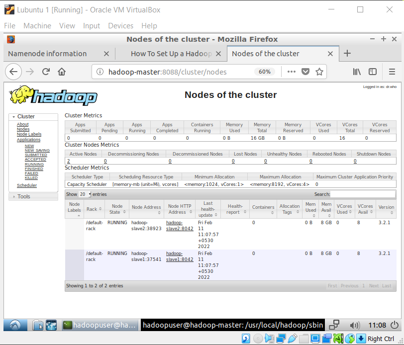
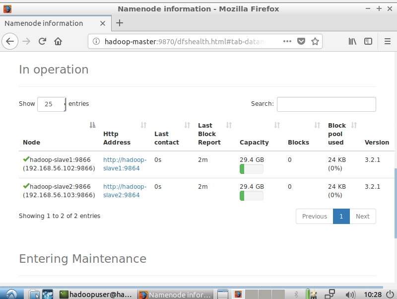
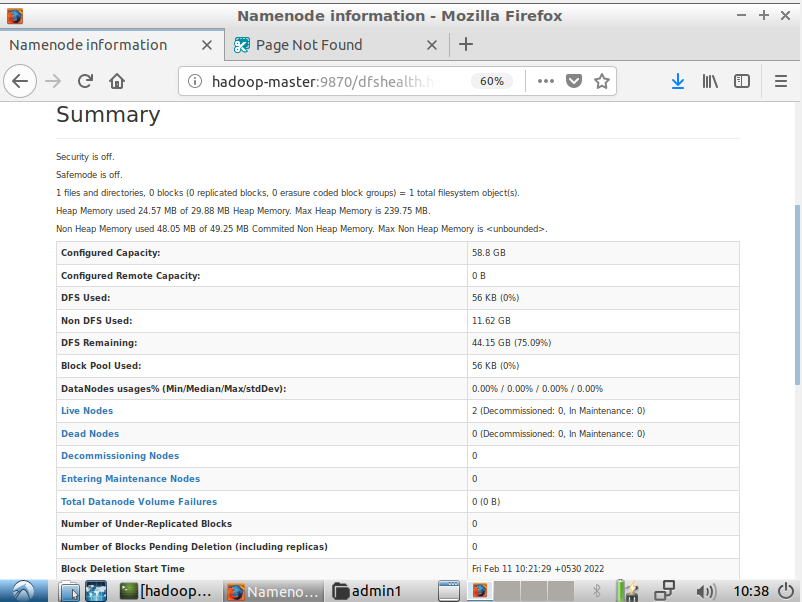
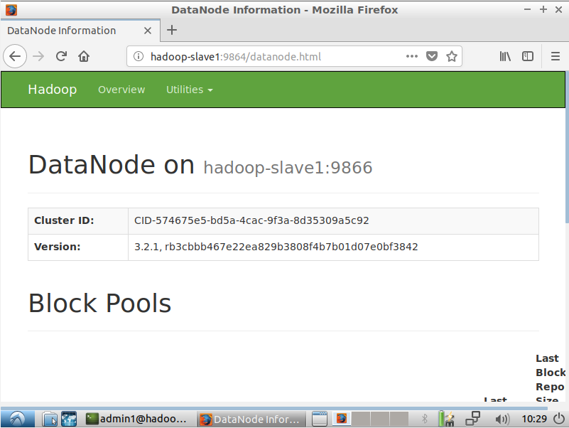
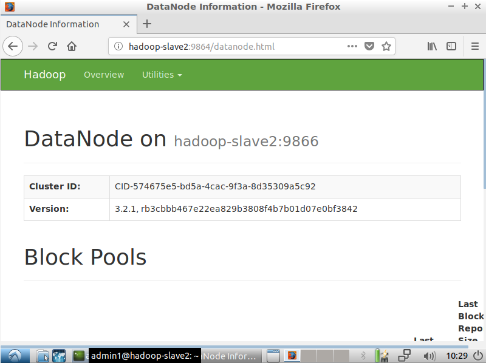

<div>
    <center>
        <h1>
            Hadoop Lab
        </h1>
        <h3>
            CSE 328
        </h3>
    </center>
    <br>
    <br>
    <center>
        <h2>
            Assignment-2
        </h2>
        <br>
    </center>
</div>


<pre>
    Gyanendra Kr. Shukla
    CSE 1
    191112040
</pre>

# Setting up a Hadoop Cluster with 2 nodes


## Screenshots


fig: 2 slaves in the hadoop cluster as seen from hadoop master


fig: namenode information


fig: namenode overview


fig: slave 1


fig: slave 2


## Steps
1. Create 3 virtual machines with `ssh` and `pdsh` installed on them. Setup `ssh-keygen` and ssh to `localhost`.

2. Install `openjdk-8-jdk` and `hadoop`. Move hadoop to `/usr/local/hadoop/`. 

3. Create a new user `hadoopuser`, add it to `hadoopuser` group, give it root permissions to hadoop directory and add it to `sudo` group.

4. Get the ip address of the three machines and add them to `/etc/hosts` file as - 

| ip addr | hostname |
----------|-----------
| IP Master Machine | hadoop-master |
| IP Slave1 Machine | hadoop-slave1 |
| IP Slave2 Machine | hadoop-slave2 |


5. Change the hostname of machines to match the hostname (`/etc/hostname`) you gave in last step.

6. Reboot the system and switch to `hadoopuser` user with `su - hadoopuser`.

7. Create a ssh key and copy it to all other machines.
```
ssh-copy-id hadoopuser@hadoop-master
ssh-copy-id hadoopuser@hadoop-slave1
ssh-copy-id hadoopuser@hadoop-slave2
```

8. On the hadoop master, in the `/usr/local/hadoop/etc/hadoop/core-site.xml` file, add 
```
<configuration>
<property>
<name>fs.defaultFS</name>
<value>hdfs://hadoop-master:9000</value>
</property>
</configuration>
```

9. In hadoop master, in the `/usr/local/hadoop/etc/hadoop/hdfs-site.xml` file, add
```
<configuration>
<property>
<name>dfs.namenode.name.dir</name><value>/usr/local/hadoop/data/nameNode</value>
</property>
<property>
<name>dfs.datanode.data.dir</name><value>/usr/local/hadoop/data/dataNode</value>
</property>
<property>
<name>dfs.replication</name>
<value>2</value>
</property>
</configuration>
```

10. In hadoop master, in the `/usr/local/hadoop/etc/hadoop/workers` file, add the slaves
```
hadoop-slave1
hadoop-slave2
```

11. Next, copy these configuration files to slave machines using 
```
scp /usr/local/hadoop/etc/hadoop/* hadoop-slave1:/usr/local/hadoop/etc/hadoop/
scp /usr/local/hadoop/etc/hadoop/* hadoop-slave2:/usr/local/hadoop/etc/hadoop/
```

12. Format the hadoop filesystem using `hdfs namenode -format`

13. Finally, start the HDFS using `start-all.sh`

14. On `hadoop-master:9870` we can see that our slaves in operation.

15. To configure yarn, export on the master machine - 
```
export HADOOP_HOME="/usr/local/hadoop"
export HADOOP_COMMON_HOME=$HADOOP_HOME
export HADOOP_CONF_DIR=$HADOOP_HOME/etc/hadoop
export HADOOP_HDFS_HOME=$HADOOP_HOME
export HADOOP_MAPRED_HOME=$HADOOP_HOME
export HADOOP_YARN_HOME=$HADOOP_HOME
```

16. Next, on the slave machines, in `/usr/local/hadoop/etc/hadoop/yarn-site.xml` file, add
```
<property>
<name>yarn.resourcemanager.hostname</name>
<value>hadoop-master</value>
</property>
```

17. Finally, start the yarn on master machine with `start-yarn.sh`

18. Check the cluster and nodes on `hadoop-master:8088/cluster`.

Following these steps, we've setup hadoop cluster with 2 nodes.