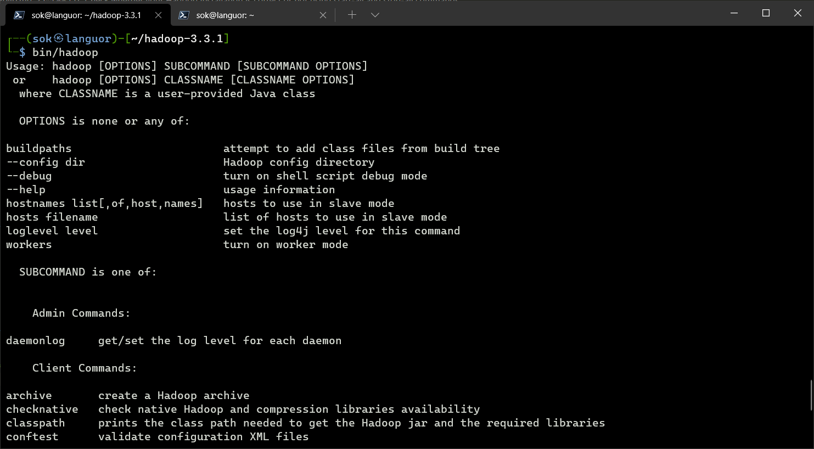
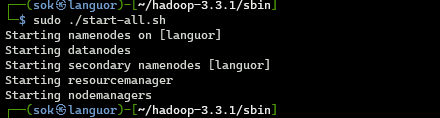
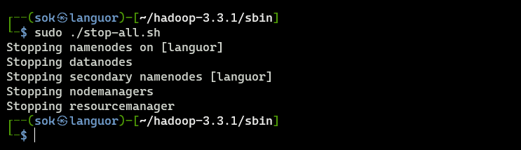
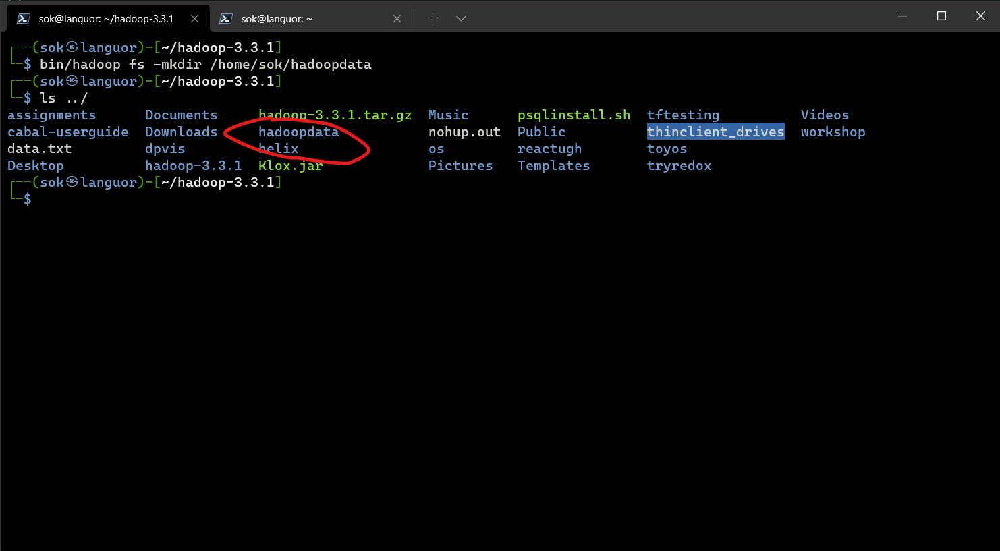
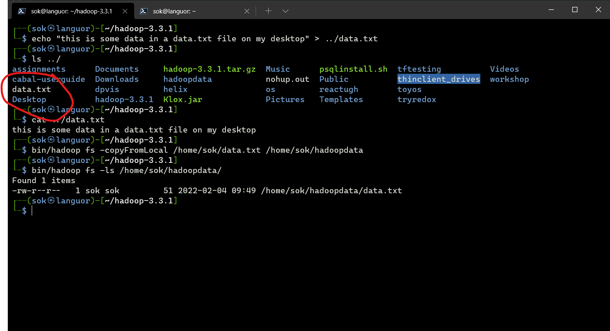
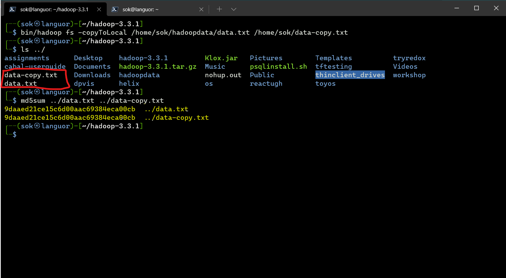

<div>
    <center>
        <h1>
            Hadoop Lab
        </h1>
        <h3>
            CSE 328
        </h3>
    </center>
    <br>
    <br>
    <center>
        <h2>
            Assignment-3
        </h2>
        <br>
    </center>
</div>


<pre>
    Gyanendra Kr. Shukla
    CSE 1
    191112040
</pre>


## Q1. Check whether your Hadoop installation is correct or not using start-all and stop-all commands.

I exported some environment variables to the `start-all.sh` and `stop-all.sh` files.

```
export HDFS_NAMENODE_USER="sok"
export HDFS_DATANODE_USER="sok"
export HDFS_SECONDARYNAMENODE_USER="sok"
export YARN_RESOURCEMANAGER_USER="sok"
export YARN_NODEMANAGER_USER="sok"
```

Then, I ran the `start-all.sh` and `stop-all.sh` files in 
the sbin directory of the Hadoop installation.





## Q2. Create a new directory in your Hadoop installation.
I created a new directory named `hadoopdata` in my home directory 
using the command
```
bin/hadoop fs -mkdir /home/sok/hadoopdata
```


## Q3. Create file data.txt on Desktop and the copy it to the directory created. Display the content of HDFS folder.

I created a file name `data.txt` by simplying echoing the contents in a file. I then copied the file using `-copyFromLocal` command. Then, I displayed the contents of the folder using the command `fs -ls` command.

```
# creating a file
echo "this is some data in a data.txt file on my desktop" > ../data.txt

# copying the file to the hadoop directory
bin/hadoop fs -copyFromLocal home/sok/data.txt /home/sok/hadoopdata 

# Displaying the contents of hdfs folder
bin/hadoop fs -ls /home/sok/hadoopdata
```


## Q4. Create copy of data.txt present in hadoop on Desktop with name “data-copy.txt” then compare them using md5 command.

I copied the `data.txt` file by using `-copyToLocal` command. Then, I used the command `md5sum` to check the md5sum of the file.

```
# copying the file from hadoop to the desktop
bin/hadoop fs -copyToLocal /home/sok/hadoopdata/data.txt /home/sok/data-copy.txt

# checking the md5sum of the file
md5sum ../data.txt ../data-copy.txt
```
