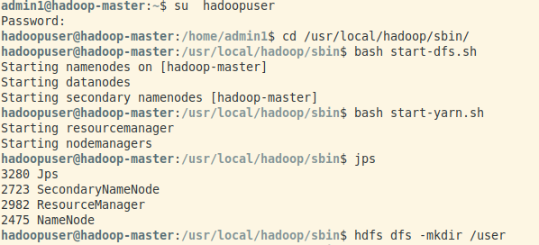
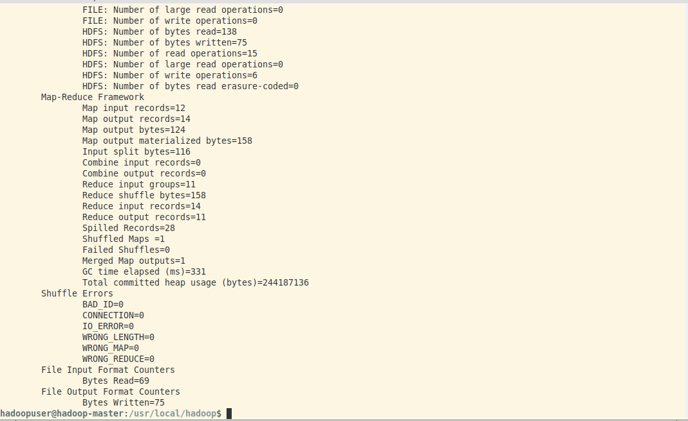
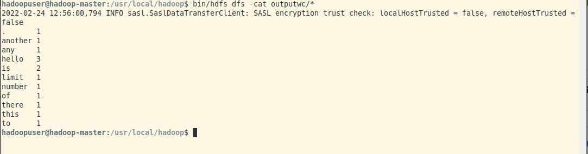
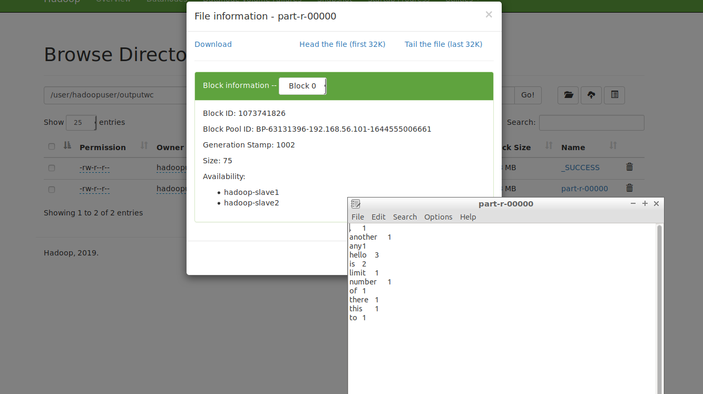
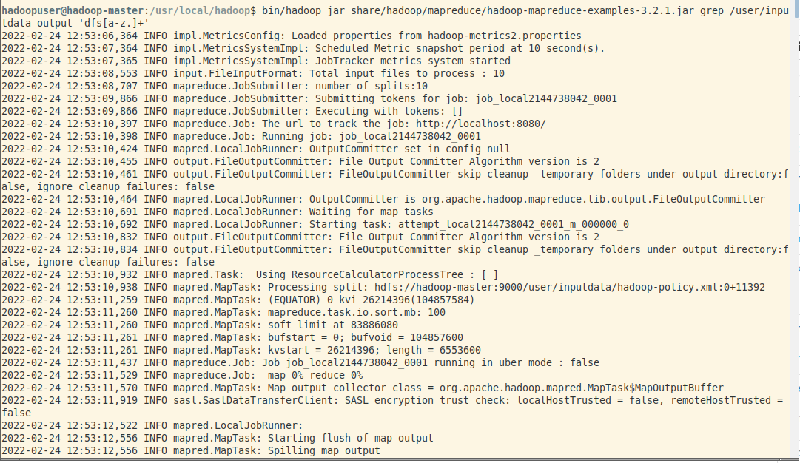
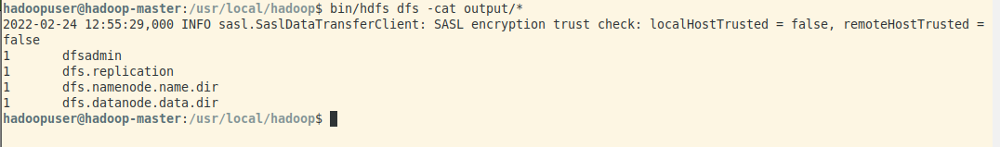

<div>
    <center>
        <h1>
            Hadoop Lab
        </h1>
        <h3>
            CSE 328
        </h3>
    </center>
    <br>
    <br>
    <center>
        <h2>
            Assignment-4
        </h2>
        <br>
    </center>
</div>


<pre>
    Gyanendra Kr. Shukla
    CSE 1
    191112040
</pre>


## 1. Compile and Run the given java file 

I followed these steps to compile and run the word count map reduce file on hadoop- 

1. ssh to `localhost` and switch to `hadoopuser` using `su hadoopuser`.

2. Start `dfs` and `yarn` using `bash start-dfs.sh` and `bash start-yarn.sh` respectively.

3. Move the input data to hdfs using `bin/hdfs dfs -put /home/admin1/input user/inputdata`.

4. cd to the directory containing the wordcount java file.
5. To compile the java program, run - 
```
javac -classpath $HADOOP_HOME/share/common/hadoop-common-3.2.1.jar:$HADOOP_HOME/share/hadoop/mapreduce/hadoop-mapreduce-client-core-3.2.1.jar:$HADOOP_HOME/share/hadoop/common/lib/commons-cli-1.2.jar -d /home/hadoopuser/wordcount *.java
```

6. Three `.class` files will be created in the same directory. Move them to a new directory.
7. Convert the `.class` files to `.jar` files using 
```
jar -cvf My1WCMapReduce.jar -C /home/hadoopuser/wordcount/wordcountf .
```

8. `cd` to hadoop installation directory with `cd /usr/local/hadoop`.
9. Execute the jar file with 
```
bin/hadoop jar /home/hadoopuser/wordcountf/My1WCMapReduce.jar My1WCMapReduce /user/inputdata outputwc
```


10. Checkin the output using `bin/hdfs dfs -cat outputwc/*`

11. Checking the output in the hdfs web directory interface.



## 2. Compile and Run the example jar file

Since all the examples in the hadoop are already in `jar` format, we can directly execute them.

1. Move the `etc/hadoop/*.xml` files to input directory with `bin/hdfs dfs -put /etc/hadoop/* /user/inputdata`.

2. Run the example using `bin/hadoop jar share/hadoop/mapreduce/hadoop-mapreduce-examples-3.3.1.jar grep input output 'dfs[a-z.]+'

3. Check the output using `bin/hdfs dfs -cat output/*`



### The Map Reduce File used in 1st question - 

```java
import java.io.IOException;
import java.util.StringTokenizer;
import org.apache.hadoop.io.IntWritable;
import org.apache.hadoop.io.LongWritable;
import org.apache.hadoop.io.Text;
import org.apache.hadoop.mapreduce.Mapper;
import org.apache.hadoop.mapreduce.Reducer;
import org.apache.hadoop.conf.Configuration;
import org.apache.hadoop.mapreduce.Job;
import org.apache.hadoop.mapreduce.lib.input.TextInputFormat;
import org.apache.hadoop.mapreduce.lib.output.TextOutputFormat;
import org.apache.hadoop.mapreduce.lib.input.FileInputFormat;
import org.apache.hadoop.mapreduce.lib.output.FileOutputFormat;
import org.apache.hadoop.fs.Path;
 
public class My1WCMapReduce
{
    public static class Map extends Mapper<LongWritable,Text,Text,IntWritable> {
        public void map(LongWritable key, Text value,Context context) throws
        IOException,InterruptedException{
            String line = value.toString();
            StringTokenizer tokenizer = new StringTokenizer(line);
            while (tokenizer.hasMoreTokens()) {
                value.set(tokenizer.nextToken());
                context.write(value, new IntWritable(1));
            }
        }
    }

    public static class Reduce extends Reducer<Text,IntWritable,Text,IntWritable> {
        public void reduce(Text key, Iterable<IntWritable> values,Context context)
            throws IOException,InterruptedException {
                int sum=0;
                for(IntWritable x: values) {
                sum+=x.get();
                }
                context.write(key, new IntWritable(sum));
        }
    }

    public static void main(String[] args) throws Exception {
        Configuration conf= new Configuration();
        Job job = new Job(conf,"Our Word Count Program");
        job.setJarByClass(My1WCMapReduce.class);
        job.setMapperClass(Map.class);
        job.setReducerClass(Reduce.class);
        job.setOutputKeyClass(Text.class);
        job.setOutputValueClass(IntWritable.class);
        job.setInputFormatClass(TextInputFormat.class);
        job.setOutputFormatClass(TextOutputFormat.class);
        Path outputPath = new Path(args[1]);
        //Configuring the input/output path from the filesystem into the job
        FileInputFormat.addInputPath(job, new Path(args[0]));
        FileOutputFormat.setOutputPath(job, new Path(args[1]));
        //deleting the output path automatically from hdfs so that we don't have to
        //delete it explicitly
        outputPath.getFileSystem(conf).delete(outputPath);
        //exiting the job only if the flag value becomes false
        System.exit(job.waitForCompletion(true) ? 0 : 1);
    }
}
```

