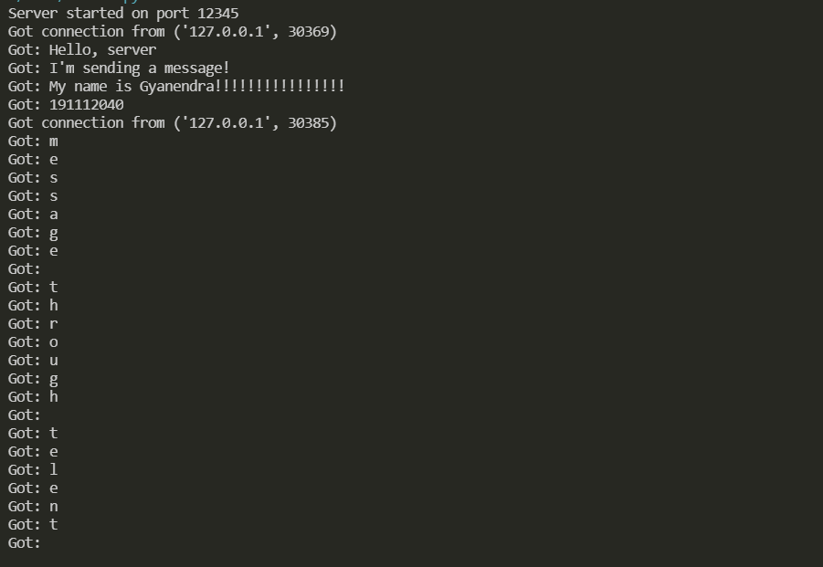
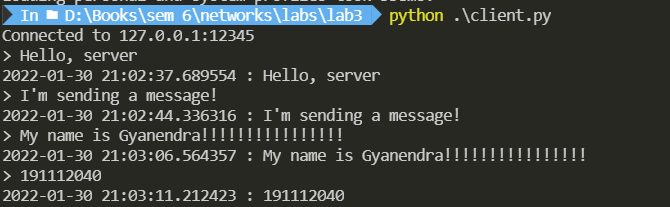
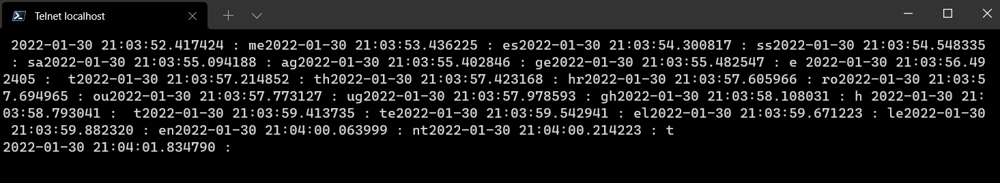

<div>
    <center>
        <h1>
            Computer Network Lab
            <br>
            CSE-325
        </h1>
        <h3>
            Assignment - 3
        </h3>
    </center>
</div>


<pre>
Submitted by - 
    Gyanendra Shukla
    CSE 1
    191112040
</pre>

**To Write a Socket Program to implement ECHO**

An echo server is a program that listens for a message from a client and then sends the same message back to the client.

I've implemented the server in python. The server listens on port 12345 for any message and returns the message with current timestamp prepended.

**Server**
```python
from datetime import datetime
import socket

class Server:
    def __init__(self, port) -> None:
        self.port = port
        self.sock = socket.socket(socket.AF_INET, socket.SOCK_STREAM)
        self.sock.bind(('', port))
        self.sock.listen()
        print('Server started on port {}'.format(port))

    def run(self) -> None:
        while True:
            conn, addr = self.sock.accept()
            print('Got connection from', addr)
            with conn:
                while True:
                    data = conn.recv(1024)
                    if not data:
                        break
                    else:
                        print(f'Got: {data.decode()}')
                    cur_time = datetime.now()
                    x = f'{cur_time} : {data.decode()}'
                    conn.sendall(x.encode())
            

    def __del__(self) -> None:
        self.sock.close()
        print('Server closed')


if __name__ == '__main__':
    server = Server(12345)
    server.run()

```

**Client**
```python
import socket

class Client:
    def __init__(self, host, port) -> None:
        self.host = host
        self.port = port
        self.sock = socket.socket(socket.AF_INET, socket.SOCK_STREAM)
        self.sock.connect((host, port))
        print('Connected to {}:{}'.format(host, port))

    def run(self) -> None:
        while True:
            data = input('> ')
            if not data:
                break
            self.sock.sendall(data.encode())
            data = self.sock.recv(1024)
            print(data.decode())

    def __del__(self) -> None:
        self.sock.close()
        print('Connection closed')


if __name__ == '__main__':
    client = Client('127.0.0.1', 12345)
    client.run()
```

**Output**


											Fig: Messages received by the server

<hr>
<br>

					Fig: Messages sent by the client and then messages timestamped by the server returned to the client

<hr>
<br>

														Fig: Connecting on server through telnet


<hr>
<br>