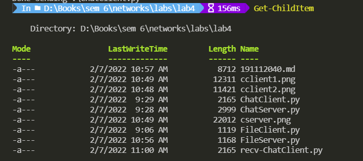

<div>
    <center>
        <h1>
            Computer Network Lab
            <br>
            CSE-325
        </h1>
        <h3>
            Assignment - 3
        </h3>
    </center>
</div>


<pre>
Submitted by - 
    Gyanendra Shukla
    CSE 1
    191112040
</pre>


## To write a Socket Program to implement CHAT between client & server

I implemented a program where multiple clients can connect to the server and send messages to each other. The Server listens to any incoming connection and sends the message to all the clients. 

### Chat Server
```python
import socket
import select

IP = "127.0.0.1"
PORT = 12345

class ChatServer:
    HEADER_LENGTH = 10
    def __init__(self, ip, port) -> None:
        self.server_socket = socket.socket(socket.AF_INET, socket.SOCK_STREAM)
        self.server_socket.setsockopt(socket.SOL_SOCKET, socket.SO_REUSEADDR, 1)
        self.server_socket.bind((ip, port))
        self.server_socket.listen()

        self.socket_list = [self.server_socket]
        self.clients = {}
        print("Server started on {}:{}".format(ip, port))

    def receive_message(self, client_socket):
        try:
            message_header = client_socket.recv(self.HEADER_LENGTH)
            
            if not len(message_header):
                return False

            message_length = int(message_header.decode("utf-8").strip())
            
            return {'header': message_header, 'data': client_socket.recv(message_length)}
        
        except:
            return False

    def start(self):
        while True:
            read_sockets, _, exception_sockets = select.select(self.socket_list, [], self.socket_list)
            for notified_socket in read_sockets:
                if notified_socket == self.server_socket:
                    client_socket, client_address = self.server_socket.accept()

                    user = self.receive_message(client_socket)

                    if user is False:
                        continue

                    self.socket_list.append(client_socket)
                    self.clients[client_socket] = user

                    print("Accepted new connection from {}:{}, username: {}"
                            .format(*client_address, user['data'].decode("utf-8")))
                
                else:
                    message = self.receive_message(notified_socket)

                    if message is False:
                        print("Closed connection from: {}".format(self.clients[notified_socket]['data'].decode("utf-8")))

                        self.socket_list.remove(notified_socket)
                        del self.clients[notified_socket]
                        continue

                    user = self.clients[notified_socket]
                    print("Received message from {}: {}".format(user['data'].decode("utf-8"), message['data'].decode("utf-8")))

                    for client_socket in self.clients:
                        if client_socket != notified_socket:
                            client_socket.send(user['header'] + user['data'] + message['header'] + message['data'])

            for notified_socket in exception_sockets:
                # If we've got exceptional socket, probably it's broken one
                # so we need to remove it from socket list
                self.socket_list.remove(notified_socket)
                del self.clients[notified_socket]


if __name__ == "__main__":
    server = ChatServer(IP, PORT)
    server.start()
```

### Chat Client
```python
import socket
import select
import errno
import sys


IP = "127.0.0.1"
PORT = 12345

class ChatClient:
    HEADER_LENGTH = 10
    def __init__(self, ip, port, username) -> None:
        self.client_socket = socket.socket(socket.AF_INET, socket.SOCK_STREAM)
        self.client_socket.connect((ip, port))
        self.client_socket.setblocking(False)

        self.username = username.encode("utf-8")
        self.username_header = f"{len(self.username):<{self.HEADER_LENGTH}}".encode("utf-8")
        self.client_socket.send(self.username_header + self.username)

    def start(self):
        while True:
            message = input(f"{self.username}> ")
            if message:
                message = message.encode("utf-8")
                message_header = f"{len(message):<{self.HEADER_LENGTH}}".encode("utf-8")
                self.client_socket.send(message_header + message)

            try:
                while True:
                    username_header = self.client_socket.recv(self.HEADER_LENGTH)
                    if not len(username_header):
                        print("Connection closed by the server")
                        sys.exit()
                        
                    username_length = int(username_header.decode("utf-8").strip())
                    username = self.client_socket.recv(username_length).decode("utf-8")

                    message_header = self.client_socket.recv(self.HEADER_LENGTH)
                    message_length = int(message_header.decode("utf-8").strip())
                    message = self.client_socket.recv(message_length).decode("utf-8")

                    print(f"{username}> {message}")
            except IOError as err:
                if err.errno != errno.EAGAIN and err.errno != errno.EWOULDBLOCK:
                    print(f"Reading error: {str(err)}")
                    sys.exit()

                continue

            except Exception as e:
                print(f"Reading error: {str(e)}")
                sys.exit()

if __name__ == "__main__":
    chat_client = ChatClient(IP, PORT, str(sys.argv[1]))
    chat_client.start()
```

### Output

Fig: Chat Server

<br>


Fig: Chat Client 1

<br>


Fig: Chat Client 2


<br><br>


## To write a Socket Program to implement File Transfer between client & server

I wrote a program to implement file transfer between client and server. The server receives the file from the client. The client sends the file it has to send to the server through command line args.

The received file has a `recv-` prefix.

### File Transfer Server
```python
import socket
import os

IP = "127.0.0.1"
PORT = 12345

class FileServer:
    SEPARATOR = "<SEPARATOR>"
    BUFFER_SIZE = 4096

    def __init__(self, ip, port) -> None:
        self.sock = socket.socket()
        self.sock.bind((ip, port))
        self.sock.listen()
        print(f"Listening on {ip}:{port}")

    def receive(self):
        client_socket, address = self.sock.accept()
        received = client_socket.recv(self.BUFFER_SIZE).decode()
        filename, filesize = received.split(self.SEPARATOR)

        filename = "recv-" + os.path.basename(filename)
        filesize = int(filesize)

        with open(filename, "wb") as f:
            print(f"Incoming file, saving as {filename}")
            while True:
                bytes_read = client_socket.recv(self.BUFFER_SIZE)
                if not bytes_read:
                    # we've completed receiving files
                    break
                f.write(bytes_read)
        print(f"Done receiving {filename}")

        client_socket.close()
        self.sock.close()


if __name__ == "__main__":
    server = FileServer(IP, PORT)
    server.receive()

```

### File Transfer Client
```python
import socket
import sys
import os

class FileClient:
    SEPARATOR = "<SEPARATOR>"
    BUFFER_SIZE = 4096

    def __init__(self, ip, port) -> None:
        self.sock = socket.socket()
        print(f"Connecting to {ip}:{port}")
        self.sock.connect((ip, port))
        print(f"Connected to {ip}:{port}")

    def send(self, filename):
        if not os.path.isfile(filename):
            print(f"{filename} does not exist!")
            return
        filesize = os.path.getsize(filename)
        self.sock.send(f"{filename}{self.SEPARATOR}{filesize}".encode())

        with open(filename, "rb") as f:
            print(f"Sending {filename}")
            while True:
                bytes_read = f.read(self.BUFFER_SIZE)
                if not bytes_read:
                    # we've completed sending files
                    break
                self.sock.sendall(bytes_read)
        print(f"Done sending {filename}")

        self.sock.close()


if __name__ == "__main__":
    client = FileClient("127.0.0.1", 12345)
    filename = sys.argv[1]
    client.send(filename)
```

### Output


Fig: Files before sending

<br>


Fig: File Transfer Server

<br>


Fig: File Transfer Client

<br>


Fig: Files after sending (recv-ChatClient.py at the bottom)