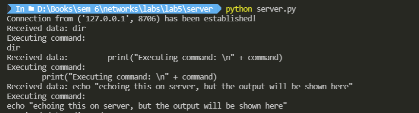
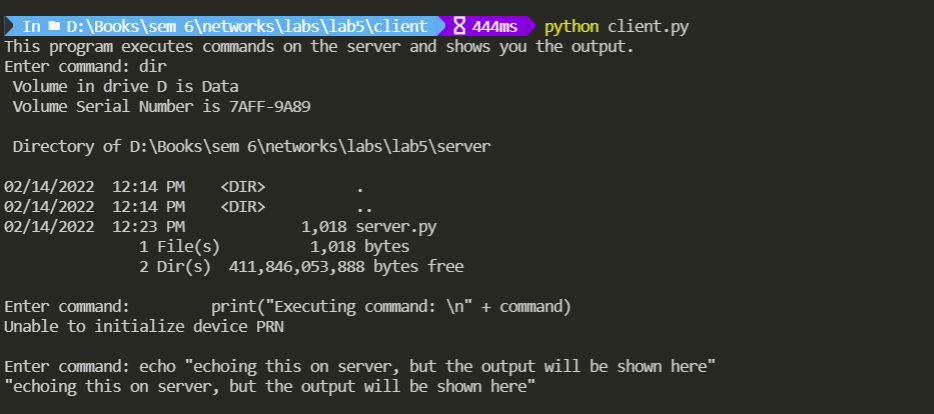

# Computer Network Lab

##

## CSE-325


###  Assignment - 5


```
Submitted by - 
    Gyanendra Shukla
    CSE 1
    191112040
```


## To implement Remote Command Execution(RCE)

I implemented a program where a client connects to a server and execute commands on the server. I take a command from the client and send it on the server. 
On the server, I use python's `subprocess` module to run the command and store the output in a pipe. This is equivalent to C's `popen` function. I then take the output from the pipe and send it back to the client. 

### RCE Server
```python
import socket
import subprocess

HOST = "127.0.0.1"
PORT = 4204

class Server:
    def __init__(self) -> None:
        self.socket = socket.socket(socket.AF_INET, socket.SOCK_STREAM)
        self.socket.bind((HOST, PORT))
        self.socket.listen()

    def accept(self):
        """
        This function accpets a client connection and then 
        if it recieves any data, it sends it to `execute`
        function and sends back the returned value back
        to the client.
        """
        conn, addr = self.socket.accept()
        print(f"Connection from {addr} has been established!")
        with conn:
            while True:
                data = conn.recv(1024)
                if not data:
                    break
                print(f"Received data: {data.decode('utf-8')}")
                conn.sendall(self.execute(data.decode('utf-8')))
    
    def execute(self, command):
        """
        This function takes a command as input and executes it,
        it then returns the output of the command.
        """
        print("Executing command: \n" + command)
        x = subprocess.run(command, shell=True, stdout=subprocess.PIPE)
        if x.returncode == 0 and len(x.stdout) > 0:
            return x.stdout
        return "".encode('utf-8')

if __name__ == "__main__":
    server = Server()
    server.accept()
```

### Chat Client
```python
import socket
import subprocess

HOST = "127.0.0.1"
PORT = 4204

class Client:
    def __init__(self) -> None:
        self.socket = socket.socket(socket.AF_INET, socket.SOCK_STREAM)
        self.socket.connect((HOST, PORT))
        print("This program executes commands on the server and shows you the output.")

    def start(self):
        """
        This function takes input from the user and sends it to the server.
        The server then executes the command and returns the output.
        This function then displays that output.
        """
        while True:
            command = input("Enter command: ")
            self.socket.sendall(command.encode('utf-8'))
            data = self.socket.recv(1024)
            print(data.decode('utf-8'))

if __name__ == "__main__":
    server = Client()
    server.start()
```

### Output

Fig: RCE Server. It takes in command, executes and sends output to server

<br>


Fig: RCE Client. It sends command to server and prints the output from server.


<br><br>

