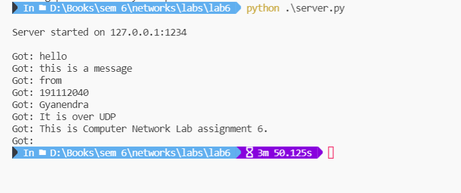
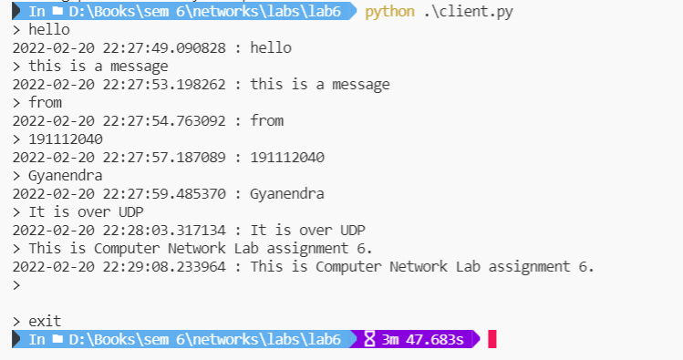

# Computer Network Lab

##

## CSE-325


###  Assignment - 6


```
Submitted by - 
    Gyanendra Shukla
    CSE 1
    191112040
```


## To implement Client-Server application using UDP

I made an echo client and server using UDP protocol. The server socket is started with `SOCK_DGRAM` argument to start
a UDP server. The client socket is started with `SOCK_DGRAM` argument to start a UDP client. I take in input in the client application in the `run` function. If the input is `exit`, I close the client socket and exit. In the server program, if I recieve an empty message, I close the server socket and exit. 


### UDP Server
```python
import socket
import datetime

class UDPServer:
    def __init__(self, addr: str, port: int) -> None:
        """
        Starting a UDP server with SOCK_DGRAM on the given address and port.
        """
        self.socket = socket.socket(socket.AF_INET, socket.SOCK_DGRAM)
        self.socket.bind((addr, port))
        print(f"\nServer started on {addr}:{port}\n")


    def run(self) -> None:
        """
        Listen for incoming messages and echo them back to the client.
        """
        while True:
            data, addr = self.socket.recvfrom(1024)
            print(f"Got: {data.decode()}")

            if data:
                d = f"{datetime.datetime.now()} : {data.decode()}"
                self.socket.sendto(d.encode(), addr)
            else:
                self.socket.sendto("".encode(), addr)
                self.socket.close()
                break


if __name__ == '__main__':
    server = UDPServer("127.0.0.1", 1234)
    server.run()
```

### UDP Client
```python
import socket

class UDPClient:
    def __init__(self) -> None:
        self.sock = socket.socket(socket.AF_INET, socket.SOCK_DGRAM)

    def send(self, message) -> None:
        try:
            sent = self.sock.sendto(message, ("localhost", 1234))
            data, server = self.sock.recvfrom(1024)
            print(data.decode())
        except Exception as e:
            print(e)
            
    def close(self) -> None:
        self.sock.close()

    def run(self) -> None:
        while True:
            message = input('> ')
            if (message=='exit'):
                self.close()
                break
            self.send(message.encode())

if __name__ == '__main__':
    client = UDPClient()
    client.run()
```

### Output

Fig: UDP Server. It takes in command, adds timestamp and echoes back to the client.

<br>


Fig: UDP Client. It sends command to server and prints the output from server.


<br><br>

