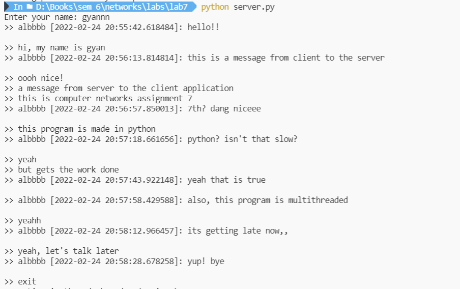
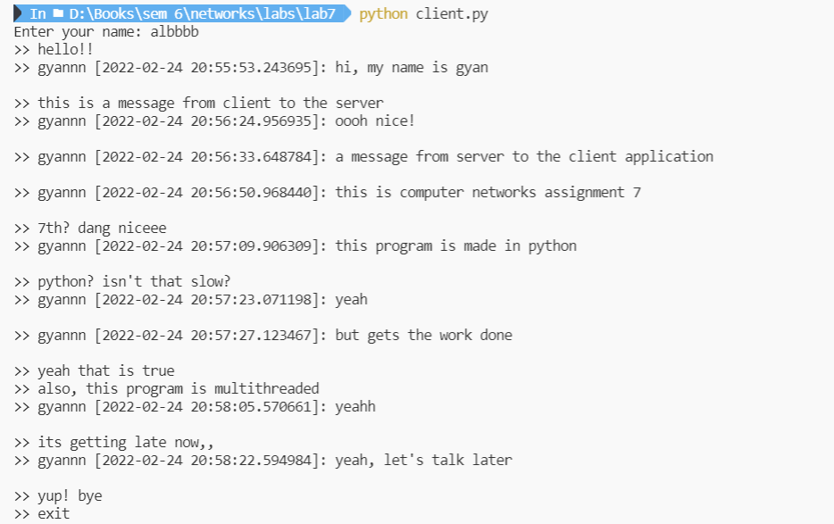

<div>
    <center>
        <h1>
            Computer Network Lab
            <br>
            CSE-325
        </h1>
        <h3>
            Assignment - 7
        </h3>
    </center>
</div>


<pre>
Submitted by - 
    Gyanendra Shukla
    CSE 1
    191112040
</pre>


## To write a Socket Program to implement CHAT between client & server

I implemented a chat program on the UDP protocol. The client enters the IP address and the port number of the server it wants to chat to. 

### Chat Server
```python
import os
import socket
import sys
import threading
import datetime

class UDPChatServer:
    def __init__(self, name, client_addr=None, client_port=None) -> None:
        self.socket = socket.socket(socket.AF_INET, socket.SOCK_DGRAM)
        self.socket.bind(('127.0.0.1', 1234))
        self.name = name
        self.client_addr = "127.0.0.1"
        self.client_port = 1235

    def send(self):
        while True:
            message = input('>> ')
            if (message=='exit'):
                break
            message = f'{self.name} [{datetime.datetime.now()}]: {message}'
            self.socket.sendto(message.encode(), (self.client_addr, self.client_port))
        self.socket.close()
        sys.exit(0)

    def recieve(self):
        while True:
            data, addr = self.socket.recvfrom(1024)
            print(data.decode())
            print("\n>> ", end="")


if __name__ == '__main__':
    name = input("Enter your name: ")
    server = UDPChatServer(name)
    x1 = threading.Thread(target=server.send)
    x2 = threading.Thread(target=server.recieve)
    x1.start()
    x2.start()
```

### Chat Client
```python
import os
import socket
import sys
import threading
import datetime

class UDPChatClient:
    def __init__(self, name, client_addr, client_port) -> None:
        self.socket = socket.socket(socket.AF_INET, socket.SOCK_DGRAM)
        self.socket.bind(('127.0.0.1', 1235))
        self.name = name
        self.client_addr = client_addr
        self.client_port = client_port

    def send(self):
        while True:
            message = input('>> ')
            if (message=='exit'):
                break
            message = f'{self.name} [{datetime.datetime.now()}]: {message}'
            self.socket.sendto(message.encode(), (self.client_addr, self.client_port))
        self.socket.close()
        sys.exit(0)

    def recieve(self):
        while True:
            data, addr = self.socket.recvfrom(1024)
            print(data.decode())
            print("\n>> ", end="")


if __name__ == '__main__':
    name = input("Enter your name: ")
    server = UDPChatClient(name, "127.0.0.1", 1234)
    x1 = threading.Thread(target=server.send)
    x2 = threading.Thread(target=server.recieve)
    x1.start()
    x2.start()
```

### Output

Fig: Chat Server

<br>

<br>


Fig: Chat Client


<br><br>

